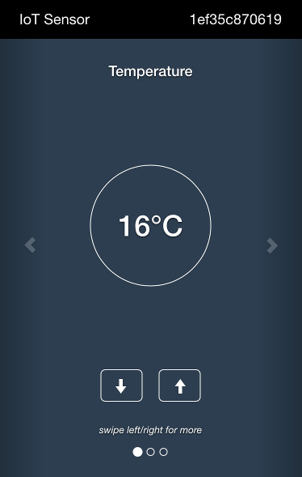

---

copyright:
  years: 2015, 2016

---

{:new_window: target="_blank"}
{:shortdesc: .shortdesc}
{:screen: .screen}
{:codeblock: .codeblock}
{:pre: .pre}

# Iniciação rápida

Última atualização: 19 de setembro de 2016
{: .last-updated}


[Iniciação rápida](https://quickstart.internetofthings.ibmcloud.com/#/) é um ambiente de simulação aberto que pode ser usado para conectar seus dispositivos rapidamente ao {{site.data.keyword.iot_full}}. Se seus dispositivos suportarem o protocolo de sistema de mensagens MQTT, eles podem ser facilmente conectados à iniciação rápida.

Para obter exemplos, receitas e tutoriais que explicam como é possível conectar diferentes dispositivos ao serviço de iniciação rápida, acesse [Receitas do DeveloperWorks](https://developer.ibm.com/recipes/), por exemplo:

- [OpenBlocks IoT BX1G](https://developer.ibm.com/recipes/tutorials/openblocks-iot-bx1g-for-iot-foundation-quickstart/)
- [Bloqueios reativos](https://developer.ibm.com/recipes/tutorials/reactive-blocks-and-java-to-iot-foundation-part-1-quickstart/)


**Importante:** se sua instância do {{site.data.keyword.iot_short_notm}} usar o serviço de iniciação rápida, aplicativos escaláveis não são suportados.

## Dispositivos simulados

Além das receitas e dos tutoriais de iniciação rápida, um dispositivo simulado baseado no navegador para dispositivos móveis está disponível para você usar para conectar qualquer dispositivo com um navegador da web ao serviço de iniciação rápida. Para ativar um dispositivo simulado baseado no navegador que se conecta ao {{site.data.keyword.iot_short}} a partir de um celular ou tablet, abra a URL (Localizador Uniforme de Recursos) a seguir:

```
http://quickstart.internetofthings.ibmcloud.com/iotsensor
```

Ao se conectar à URL (Localizador Uniforme de Recursos) do dispositivo simulado em um dispositivo móvel, um dispositivo simulado baseado no navegador conectado ao {{site.data.keyword.iot_short}} será iniciado. Use os controles de UI a seguir para gerenciar os sensores:

- Temperatura
- Humidade
- Temperatura do objeto




## Visualização de dados

Para ver os dados gerados a partir de seu dispositivo móvel, assegure que o dispositivo simulado possa ser executado em seu dispositivo móvel e, em seguida, inicie o aplicativo de iniciação rápida. Insira o ID do dispositivo de 12 caracteres que é exibido no canto superior direito da UI (interface com o usuário).


Ao ajustar os valores do sensor no dispositivo simulado, será possível ver os dados de seu dispositivo visualizado em tempo real no aplicativo de iniciação rápida, conforme descrito na captura de tela a seguir:


## Demonstração de Mosquitto

[Mosquitto](http://mosquitto.org/) é um cliente MQTT de software livre para diversas plataformas que pode ser usado para experimentos com o serviço do {{site.data.keyword.iot_short}}. Após instalar o cliente Mosquitto, escolha um ID de aplicativo e um ID de dispositivo exclusivos. Se os IDs de aplicativo e de dispositivo não forem exclusivos, sua conexão de teste poderá resultar em um conflito com outro usuário que esteja concluindo o mesmo procedimento de teste de iniciação rápida.

Os valores de *appId*, *type_id*, *device_type* e *device_id* devem ter no máximo 36 caracteres e podem conter somente os caracteres a seguir:
- Caracteres alfanuméricos (a-z, A-Z, 0-9)
- Traços (-)
- Sublinhados (_)
- Pontos (.)

Após definir o ID do aplicativo e o ID do dispositivo, crie uma conexão que represente seu aplicativo usando `mosquitto_sub`. Use os exemplos a seguir de `<applicationId>` = myApplicationId e `<deviceId>` = myDeviceId:
```
    [user@host ~]$ mosquitto_sub -h quickstart.messaging.internetofthings.ibmcloud.com -p 1883 -i "a:quickstart:myApplicationId" -t iot-2/type/mosquitto/id/myDeviceId/evt/helloworld/fmt/json

```

Enquanto o processo anterior está em execução, é possível criar seu dispositivo. Neste exemplo, conecte um dispositivo do tipo `mosquitto` e, em seguida, envie dois eventos ao serviço usando `mosquitto_pub`, conforme esboçado no código a seguir:

```
    [user@host ~]$ mosquitto_pub -h quickstart.messaging.internetofthings.ibmcloud.com -p 1883 -i "d:quickstart:mosquitto:myDeviceId" -t iot-2/evt/helloworld/fmt/json -m "{\"helloworld\": 1}"
    [user@host ~]$ mosquitto_pub -h quickstart.messaging.internetofthings.ibmcloud.com -p 1883 -i "d:quickstart:mosquitto:myDeviceId" -t iot-2/evt/helloworld/fmt/json -m "{\"helloworld\": 2}"
```
Ao verificar seu terminal de aplicativo, os dois eventos que você acaba de publicar estão exibidos, conforme esboçado na saída de exemplo a seguir:

```
   [user@host ~]$ mosquitto_sub -h quickstart.messaging.internetofthings.ibmcloud.com -p 1883 -i "a:quickstart:myApplicationId" -t iot-2/type/mosquitto/id/myDeviceId/evt/helloworld/fmt/json
    {"helloworld": 1}
    {"helloworld": 2}
```

É só isso. Ao concluir o procedimento de exemplo de iniciação rápida, você terá:
- Conectado com sucesso um dispositivo e um aplicativo ao {{site.data.keyword.iot_short}} por MQTT
- Enviado um evento do dispositivo para o serviço
- Recebido o evento em seu aplicativo


## links Relacionados

- [Iniciação rápida](https://quickstart.internetofthings.ibmcloud.com)
- [Receitas do DeveloperWorks](https://developer.ibm.com/recipes)
- [OpenBlocks IoT BX1G](https://developer.ibm.com/recipes/tutorials/openblocks-iot-bx1g-for-iot-foundation-quickstart/)
- [Bloqueios reativos](https://developer.ibm.com/recipes/tutorials/reactive-blocks-and-java-to-iot-foundation-part-1-quickstart/)
- [Aplicativo de iniciação rápida](http://quickstart.internetofthings.ibmcloud.com)
- [Mosquitto](http://mosquitto.org/)
