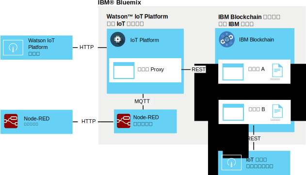

---

copyright:
  years: 2016

---

{:new_window: target="\_blank"}
{:shortdesc: .shortdesc}
{:screen: .screen}
{:codeblock: .codeblock}
{:pre: .pre}

# {{site.data.keyword.iot_short_notm}} 區塊鏈整合
{: #gettingstartedtemplate}
前次更新：2016 年 8 月 30 日
{: .last-updated}

{{site.data.keyword.iot_short_notm}} 區塊鏈整合會讓 IoT 裝置將資料提供給區塊鏈交易，這樣會將資料儲存在區塊鏈的不可變分類帳中，並將它用在區塊鏈的智慧型合約所實作的商業規則中。
{:shortdesc}

平台會採用其原生 MQTT 格式的裝置資料、將它對映至區塊鏈智慧型合約所需的資料格式，並將它傳遞至區塊鏈網狀架構，以儲存在區塊鏈分類帳中。區塊鏈網狀架構是構成 {{site.data.keyword.blockchainfull}} 實例及 Hyperledger 之同層級和憑證節點的集合。

## 區塊鏈整合架構  
{: #architecture}

一般的 {{site.data.keyword.iot_short_notm}} 區塊鏈整合環境包含下列元件：
- 產生要寫入區塊鏈分類帳之資料的一台以上裝置。
- {{site.data.keyword.Bluemix_notm}} 組織：
 - 已啟用 IoT 區塊鏈整合的 {{site.data.keyword.iot_short_notm}} 服務。
 - 已部署一個以上智慧型合約的 {{site.data.keyword.blockchainfull_notm}} 或 Hyperledger 網狀架構。
- 本端環境：
 - IoT 區塊鏈監視使用者介面

如需產生及部署智慧型合約之延伸環境設定和需求的相關資訊，請參閱[開發 {{site.data.keyword.iot_short_notm}} 區塊鏈整合的智慧型合約](blockchain/dev_blockchain.html)。  

下圖說明一般 {{site.data.keyword.iot_short_notm}} 區塊鏈整合環境。

## 開始之前
{: #byb}

- 在 IBM.com 的 [{{site.data.keyword.iot_short_notm}}](http://www.ibm.com/blockchain/) 上，取得 {{site.data.keyword.iot_short_notm}} 的概觀、其與一般區塊鏈概念的關聯，以及它的作用。
- [啟用 {{site.data.keyword.iot_short_notm}} 區塊鏈整合](reference/extensions/index.html)。
- 連接產生要寫入區塊鏈分類帳之資料的裝置。
請遵循[連接裝置](iotplatform_task.html)主題中的指示，以連接裝置。
- 安裝「監視使用者介面」。「監視使用者介面」是用來驗證 {{site.data.keyword.iot_short_notm}} 與區塊鏈網狀架構之間的連線。請遵循[區塊鏈監視使用者介面](https://github.com/ibm-watson-iot/blockchain-samples/tree/master/monitoring_ui) GitHub 目錄內可用「監視使用者介面」ReadMe 文件中的指示。

### 使用 IBM 基本情境以快速開始

若要快速開始測試 {{site.data.keyword.iot_short_notm}} 區塊鏈整合，您可以連接至 IBM 所提供的網路，並將 Node-RED 範例裝置對映至 IBM 所提供的範例合約。在本主題中，此情境所需的步驟標示為 **IBM 基本情境**。  
**重要事項：**請注意，所有範例區塊鏈使用者都可以看到 IBM 所提供的範例區塊鏈分類帳及其所有資料。請不要將任何機密性資訊儲存在 IBM 所提供的範例區塊鏈中。此外，支援範例及貿易航線合約的範例網狀架構，包括每個同層級的連線資訊，也可能會改變。Watson IoT Blockchain 社群的 [IoT Blockchain Connection Info](https://www.ibm.com/developerworks/community/wikis/home?lang=en#!/wiki/W7a44a0e604d9_4a90_89b7_0a2bdbe81b00/page/Blockchain%20Fabric%20Connections) Wiki 頁面中提供連線詳細資料。

IBM 所提供的基本 {{site.data.keyword.iot_short_notm}} 區塊鏈整合環境包含下列元件：
- {{site.data.keyword.Bluemix_notm}}:
 - 已啟用 IoT 區塊鏈整合的 {{site.data.keyword.iot_short_notm}} 服務。
 - 選用項目：執行 IoT 裝置模擬器的 Node-RED 應用程式。
 **附註：**您也可以在本端 Node-RED 環境中部署裝置模擬器。
- 本端環境：
 - Node.js
 - IoT 區塊鏈監視使用者介面
- IBM 已提供：
 - 選用項目：已預先部署簡單智慧型合約的 {{site.data.keyword.iot_short_notm}} 網狀架構。

下列架構圖說明此範例情境所需的元件。

**IBM 基本情境：**遵循[建立及連接 Node-RED 裝置模擬器](nodereddevice_sample.html)主題中的指示，建立 Node-RED 裝置模擬器。如需區塊鏈整合，請在匯入節點資料時，使用區塊鏈裝置特有的節點資訊。Watson IoT Blockchain 社群的 [Node-RED Device Simulator](https://www.ibm.com/developerworks/community/wikis/home?lang=en#!/wiki/W7a44a0e604d9_4a90_89b7_0a2bdbe81b00/page/Node-RED%20Device%20Simulator) Wiki 頁面中提供節點資訊。

## 連接至區塊鏈網狀架構
{: #getting_started}
因為已啟用 {{site.data.keyword.iot_short_notm}} 區塊鏈整合，所以您現在可以連接至 {{site.data.keyword.blockchainfull_notm}} 或 Linux Foundation Hyperledger 所管理的區塊鏈網狀架構。

1. 連接至區塊鏈網狀架構
 1. 從 {{site.data.keyword.iot_short_notm}} 儀表板中，按一下功能表資訊看板中的 ，然後向下捲動至**延伸規格**區段。
 2. 按一下區塊鏈參數，以啟用 {{site.data.keyword.iot_short_notm}} 的區塊鏈。
 4. 按一下**新增網狀架構**。  
 5. 輸入網狀架構資訊。  
 <table>
<thead>
<tr>
<th>參數</th>
<th>值</th>
</tr>
</thead>
<tbody>
<tr>
<td>網狀架構名稱</td>
<td>輸入名稱以識別 {{site.data.keyword.iot_short_notm}} 中的網狀架構。</td>
</tr>
<tr>
<td>同層級主機</td>
<td>「驗證同層級 1」伺服器的 `api_host` 位址</td>
</tr>
<tr>
<td>埠號</td>
<td>`api_port` 號碼<ul><li>如果您的實作未使用 TLS，請使用埠 80。</li><li>如果您的實作使用 TLS，請使用埠 443。</li></ul></td>
</tr>
<tr>
<td>使用 TLS</td>
<td>開啟或關閉 使用「傳輸層安全 (TLS)」來加密 {{site.data.keyword.iot_short_notm}} 與網狀架構中合約之間的通訊。預設埠號是由您所連接的已部署 {{site.data.keyword.iot_short_notm}} 實例所設定。</td>
</tr>
<tr>
<td>使用者 ID</td>
<td>用來向區塊鏈登錄智慧型合約之使用者的 `username` 字串。稍後配置「簡式使用者介面」時，也可以使用此使用者 ID。</td>
</tr>
<tr>
<td>秘密金鑰</td>
<td>使用者的 `secret` 字串</td>
</tr>
</tbody>
</table>
**IBM 基本情境：**若要連接至 IBM 所提供的網狀架構，請使用 Watson IoT Blockchain 社群的 [IoT Blockchain Connection Info](https://www.ibm.com/developerworks/community/wikis/home?lang=en#!/wiki/W7a44a0e604d9_4a90_89b7_0a2bdbe81b00/page/Blockchain%20Fabric%20Connections) Wiki 頁面中所提供的「範例合約」連線詳細資料。

 6. 按一下**儲存**。
 **附註：**如果未建立網狀架構，則您所輸入的部分資訊可能不正確。必要的話，請按一下區塊鏈開關來重新啟用區塊鏈 Proxy，然後重新建立網狀架構。  
 6. 按一下**確認所有變更**。
  網狀架構表格中即會移入新的項目。

## 將裝置資料對映至智慧型合約
{: #map_device_properties}

若要將裝置資料寫入區塊鏈分類帳，您必須先將裝置類型的裝置內容對映至智慧型合約所定義的參數。

若要將裝置資料對映至合約，請執行下列動作：
 1. 從 {{site.data.keyword.iot_short_notm}} 儀表板中，按一下功能表資訊看板中的。
 3. 按一下**對映裝置資料**。
 4. 選取要在區塊鏈中儲存其裝置資料的裝置類型。
 5. 輸入您要儲存之事件的事件名稱。
 **提示：**範例 Node-RED 區塊鏈裝置的預設事件名稱是 obc。若要尋找裝置的事件類型，請從 {{site.data.keyword.iot_short_notm}} 儀表板中選取**裝置**，然後按一下裝置名稱以開啟裝置詳細資料頁面。向下捲動至**感應器資訊**區段，以查看裝置的可用事件及資料點清單。更新「發佈至 IoT mqtt」輸出節點中的「主題」欄位，即可變更 Node-RED 裝置所發佈的事件名稱。  
 6. 按**下一步**。
 6. 選取先前所建立的網狀架構實例。
 7. 輸入合約 ID 及合約名稱。  
<table>
<thead>
<tr>
<th>參數</th>
<th>註解</th>
</tr>
</thead>
<tbody>
<tr>
<td>合約 ID</td>
<td>所對映合約的唯一 128 個字元 ID。  **重要事項：**所對映的合約必須至少支援下列方法：
- updateAsset
- readAssetSchemas  </td>
</tr>
<tr>
<td>合約名稱</td>
<td>用來識別 {{site.data.keyword.iot_short_notm}} 中合約的名稱。</td>
</tr>
</tbody>
</table>
**IBM 基本情境：**範例預先部署的智慧型合約可讓您將裝置資料點對映至特定合約屬性，以在區塊鏈分類帳中儲存資料點值。請先使用範例合約來測試裝置資料對映，再嘗試更進階的貿易航線合約或自行撰寫合約。Watson IoT Blockchain 社群的 [IoT Blockchain Connection Info](https://www.ibm.com/developerworks/community/wikis/home?lang=en#!/wiki/W7a44a0e604d9_4a90_89b7_0a2bdbe81b00/page/Blockchain%20Fabric%20Connections) Wiki 頁面中提供合約 ID。

 8. 建立將裝置內容對映至合約參數的路徑。
 會匯入合約中可用的參數。針對每一個參數，輸入對應的事件內容。
 **重要事項：**請不要包括附加到裝置訊息中資料點前面的 `d.`。
 **IBM 基本情境：**如果您使用的是 IBM 所提供的合約，請對映 Watson IoT Blockchain 社群的 [Data mapping](https://www.ibm.com/developerworks/community/wikis/home?lang=en#!/wiki/W7a44a0e604d9_4a90_89b7_0a2bdbe81b00/page/Data%20Mapping) Wiki 頁面中所列的下列參數。
 9. 在摘要頁面中，驗證已正確地輸入所有資訊。
 10. 區塊鏈頁面會顯示裝置資料與合約的對映。

恭喜，您現在已經開始進行！

## 試用 IBM 所提供的範例智慧型合約
{: #test_simple}

如果您已連接至 IBM 所提供的網狀架構，並將裝置資料對映至範例合約，則可以測試從裝置到區塊鏈分類帳的端對端資料流程。使用「IoT 區塊鏈監視使用者介面」，以檢視資產的區塊鏈活動及資料。  
**提示：**如果尚未在本端環境中安裝「監視使用者介面」，則可以立即安裝。請遵循[區塊鏈監視使用者介面](https://github.com/ibm-watson-iot/blockchain-samples/tree/master/monitoring_ui) GitHub 目錄內可用「監視使用者介面」ReadMe 文件中的指示。  
1. 將「監視使用者介面」配置成連接至 {{site.data.keyword.iot_short_notm}}。
 在「監視使用者介面」中，按一下**配置**，以配置「監視使用者介面」連線：
 <table>
<thead>
<tr>
<th>參數</th>
<th>註解</th>
</tr>
</thead>
<tbody>
<tr>
<td>API 主機及埠</td>
<td>前面附加 `http://` 的 {{site.data.keyword.iot_short_notm}} REST API 的主機及埠。使用 `api_host` 位址及 `api_port` 號碼。</td>
</tr>
<tr>
<td>Chaincode ID</td>
<td>合約 ID 是對應至「合約 ID」項目的 128 個字元的英數字串。  
**重要事項：**當您剪下並貼上 Chaincode ID 時，請確定 ID 中不包括任何空格。如果未正確地輸入 ID，則會顯示區塊鏈分類帳項目，但資產搜尋功能不會運作。
</td>
</tr>
<tr>
<td>安全環境定義</td>
<td>需要有此參數，才能連接至 Bluemix 上的 {{site.data.keyword.iot_short_notm}} 實例。使用 secureContext 項目。  
**重要事項：**secureContext 應該是您建立網狀架構時所定義之網狀架構的授權使用者。
</td>
</tr>
</tbody>
</table>
**IBM 基本情境：**若要將「監視使用者介面」配置成連接至基本或貿易航線合約，請使用 Watson IoT Blockchain 社群的 [IoT Blockchain Connection Info](https://www.ibm.com/developerworks/community/wikis/home?lang=en#!/wiki/W7a44a0e604d9_4a90_89b7_0a2bdbe81b00/page/Blockchain%20Fabric%20Connections) Wiki 頁面中所提供的連線詳細資料。
2. 在 Node-RED 流程編輯器中，按一下 CON123 節點中的按鈕來注入裝置資料、將它當作訊息傳送至 {{site.data.keyword.iot_short_notm}}，並透過簡單合約寫入 {{site.data.keyword.iot_short_notm}} 分類帳。
**提示：**若要取得連續資料流程，請按兩下注入節點、將 Repeat 參數設為 `interval`，並配置適當的間隔（例如每 1 分鐘）。
3. 在「監視使用者介面」中，驗證裝置資料如預期地以區塊鏈區塊方式顯示。  
  1. 驗證當您從裝置中注入資料時，會將區塊新增至鏈結。
  **重要事項：**請不要使用瀏覽器的「重新整理」按鈕來重新整理「監視使用者介面」。每隔幾秒即會自動重新整理使用者介面。使用瀏覽器的「重新整理」按鈕會將使用者介面設定重設為其預設值，而且您必須重新配置「監視使用者介面」以查看合約區塊鏈。
  2. 若要查看資產的最新分類帳資訊，請在「資產 ID 搜尋」欄位中輸入資產 ID，然後按一下**提交**。範例：`CON123`
  若要查看多個使用相同合約之資產的區塊鏈資料，請輸入該資產名稱，然後按一下**提交**。按一下**重設**，以重新開始。
  **提示：**
    - 開啟「輪詢變更」特性將確保使用者介面會持續輪詢所觀察/監視之資產的任何變更，並在區塊鏈中確定變更時盡快重新整理資料。
    - 區塊鏈裝置的預設 assetID 是 "CON123"。如果您已修改裝置訊息或已更新 Node-RED 裝置模擬器中的 assetID，則可以在 {{site.data.keyword.iot_short_notm}} 中查閱 assetID。移至**裝置**頁面，然後按一下裝置以開啟裝置詳細資料頁面。向下捲動至**感應器資訊**區段，以查看裝置的資料點清單。使用 `d.assetID` 資料點的值作為您的 assetID。

## 後續步驟  
{: #next_steps}  
您現在已安裝及配置基本 IoT 區塊鏈整合 {{site.data.keyword.iot_short_notm}} 環境。在這個最小情境中，基本智慧型合約可讓您將裝置資料寫入區塊鏈分類帳，以建立持久的裝置資料歷程。現在，您已完成這些起始步驟並且已測試簡單合約，可以嘗試更進階的貿易航線範例合約以及自行撰寫合約。    

[開發 {{site.data.keyword.iot_short_notm}} 區塊鏈整合的智慧型合約](blockchain/dev_blockchain.html)主題中所提供的這些更進階步驟的指示。
